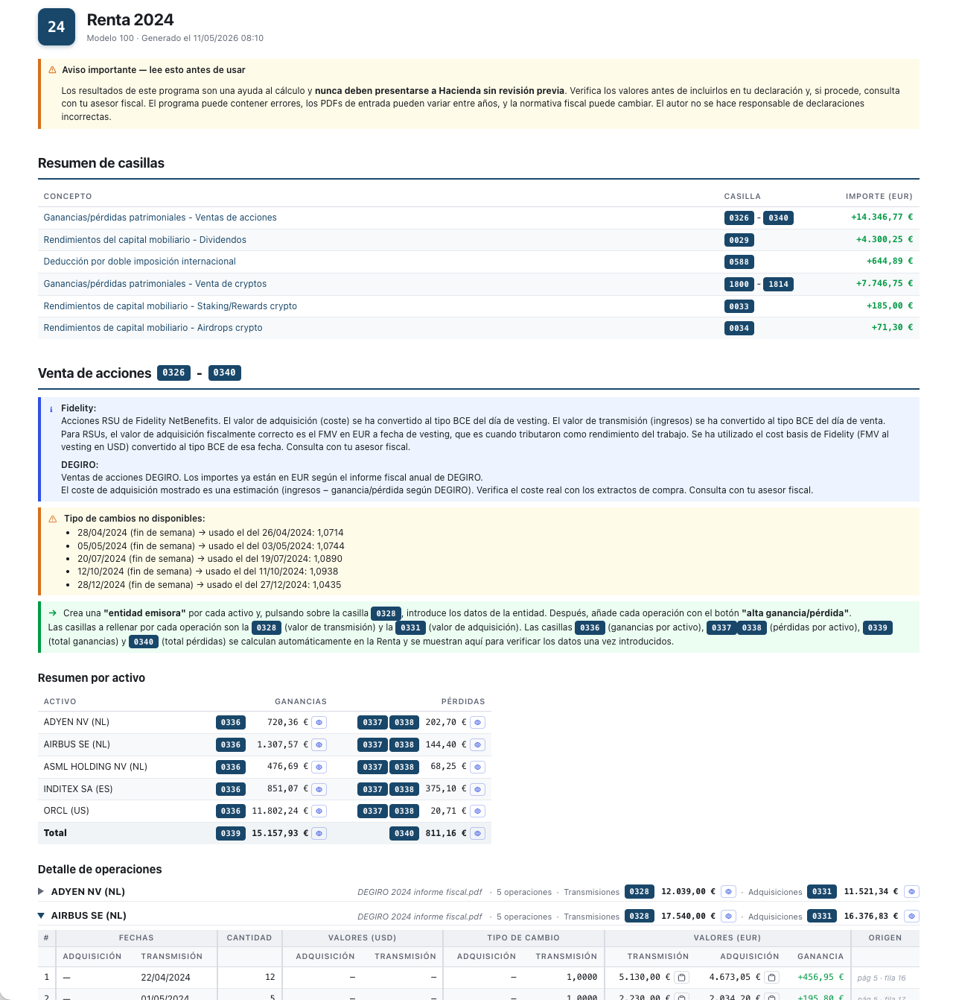

<p align="center">
  
</p>

[](https://github.com/jelies/renta-calculator/actions/workflows/test.yml)
[](LICENSE)

CLI para calcular las casillas de la declaración de la renta española (modelo 100) a partir de los informes de Fidelity NetBenefits, DEGIRO y Koinly.

> **Aviso importante**: los resultados generados por este programa son una ayuda para el cálculo y la cumplimentación del modelo 100 en Renta Web. **Nunca deben presentarse directamente a Hacienda sin revisión previa**. Los valores deben ser verificados por el usuario y, si procede, por un asesor fiscal, antes de incluirlos en la declaración. El programa puede contener errores, los PDFs de entrada pueden variar entre años, y la normativa fiscal puede cambiar. El autor no se hace responsable de declaraciones incorrectas.

---

## Información general

### Casillas calculadas

| Casilla | Concepto |
|---------|----------|
| 0029 | Rendimientos del capital mobiliario - Dividendos |
| 0326–0340 | Ganancias/pérdidas patrimoniales - Ventas de acciones |
| 1800–1814 | Ganancias/pérdidas patrimoniales - Venta de cryptos |
| 0588 | Deducción por doble imposición internacional |
| 0033 | Rendimientos de capital mobiliario - Staking/Rewards crypto |
| 0034 | Rendimientos de capital mobiliario - Airdrops crypto |

> Este programa es una herramienta de ayuda. El informe generado incluye notas fiscales detalladas por cada sección. Verifica siempre los resultados antes de presentar la declaración.

### Entradas soportadas

- **Fidelity NetBenefits** — "Custom transaction summary" (PDF descargado desde la web)
- **DEGIRO** — "Informe Fiscal Anual" de flatexDEGIRO Bank AG (PDF)
- **Koinly** — "Complete tax report" en español (PDF)
- **Koinly** — "Informe de plusvalías para España" (PDF, opcional) — cuando está presente, sustituye los totales de adquisición/transmisión por activo por los valores oficiales del informe, evitando errores de redondeo acumulado

### Tipos de cambio

Los tipos de cambio USD/EUR se obtienen automáticamente del **Banco Central Europeo**:

`https://data-api.ecb.europa.eu/service/data/EXR/D.USD.EUR.SP00.A`

---

## Uso de la herramienta

### Instalación

Requiere Python 3.11+ y [pipx](https://pipx.pypa.io).

```bash
pipx install renta-calculator
```

Para actualizar a la última versión:

```bash
pipx upgrade renta-calculator
```

### Ejecutar

```bash
renta-calculator --input carpeta/ [--output fichero.html] [--year 2024]
```

Donde `carpeta/` contiene los PDFs de Fidelity, DEGIRO y/o Koinly. No es necesario tenerlos todos — el programa detecta automáticamente el tipo de cada PDF y procesa los que encuentre.

| Opción | Descripción | Default |
|--------|-------------|---------|
| `--input` / `-i` | Directorio con los PDFs (o ruta a un PDF) | requerido |
| `--output` / `-o` | Fichero HTML de salida | `output/renta_{año}_{YYYYmmdd_HHMM}.html` |
| `--year` / `-y` | Año fiscal | autodetectado del PDF |

```bash
renta-calculator --input /ruta/a/mis/pdfs/
renta-calculator --input /ruta/a/mis/pdfs/ --output renta_2024.html --year 2024
```

### Output

El programa genera un **HTML autocontenido** (sin dependencias externas) con:

- Resumen de casillas con importes en EUR (cada concepto es un enlace que salta a su sección de detalle)
- Detalle de cada transacción con trazabilidad al PDF original (página y fila)
- Tipos de cambio BCE utilizados para cada conversión USD → EUR
- Notas y advertencias fiscales
- **Botones de acción** junto a los importes relevantes para facilitar la introducción y verificación de datos en Renta Web. Dos tipos:
  - 📋 **Copiar**: valores a introducir directamente en el modelo 100.
  - 👁 **Verificar**: valores que la Renta calcula automáticamente — para cuadrar contra el resultado una vez introducidos los datos (casillas 0336, 0337/0338, 0339, 0340 en ventas; total global de dividendos).
  - **Shift+click** en cualquier botón restaura su estado original sin copiar nada.
- **Toggles en la cabecera del informe**: modo privado (difumina todos los importes, útil para compartir pantalla) y tema claro/oscuro; ambos se persisten en el navegador.

### Limitaciones

- Los parsers están ajustados a formatos concretos de PDF de cada broker. Pueden romperse si el broker cambia el formato en un año futuro.
- Solo cubre las fuentes documentadas en "Entradas soportadas". Otros brokers o exchanges requieren añadir un parser nuevo (ver `SPEC.md`).
- Los tipos de cambio se obtienen del BCE en tiempo real; si la API no está disponible, los cálculos en USD quedan sin convertir y se marcan como no calculados.

---

## Desarrollo

### Setup

Requiere [uv](https://docs.astral.sh/uv/).

```bash
git clone https://github.com/jelies/renta-calculator.git
cd renta-calculator
uv run renta-calculator --input samples/1-samples/
```

`uv run` crea el entorno virtual e instala las dependencias automáticamente la primera vez (usando `uv.lock` para versiones exactas).

### Tests

```bash
uv run pytest
```

### Datos de ejemplo

El repositorio incluye tres datasets de PDFs ficticios en `samples/`:

```bash
renta-calculator --input samples/1-samples/  # datos pequeños (original)
renta-calculator --input samples/2-big/      # ~100 operaciones por sección
renta-calculator --input samples/3-empty/    # sin operaciones (estados vacíos)
```

Los PDFs se regeneran con `python scripts/generate_sample_pdfs.py`.

### Añadir un nuevo parser

Los parsers están registrados en `src/renta/parsers/__init__.py`. Para añadir soporte para otro broker, consulta la sección "Cómo añadir un nuevo parser" en [`SPEC.md`](SPEC.md).

### Contribuir

Las contribuciones son bienvenidas. Abre un issue para reportar un bug o proponer una mejora, o un PR si ya tienes un fix.

---

## Ejemplo de informe generado

[Ver informe de ejemplo](samples/output/example_report.html)

<p align="center">
  
</p>

---

## Licencia

[MIT](LICENSE)
