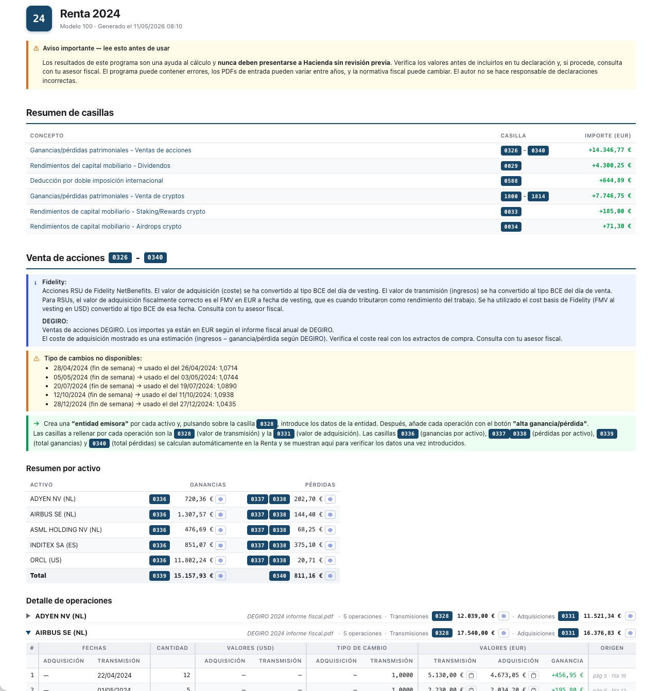

<p align="center">
  
</p>

[](https://github.com/jelies/renta-calculator/actions/workflows/test.yml)
[](LICENSE)

CLI para calcular las casillas de la declaración de la renta española (modelo 100) a partir de los informes de Fidelity NetBenefits, DEGIRO y Koinly.

> **Aviso importante**: los resultados generados por este programa son una ayuda para el cálculo y la cumplimentación del modelo 100 en Renta Web. **Nunca deben presentarse directamente a Hacienda sin revisión previa**. Los valores deben ser verificados por el usuario y, si procede, por un asesor fiscal, antes de incluirlos en la declaración. El programa puede contener errores, los PDFs de entrada pueden variar entre años, y la normativa fiscal puede cambiar. El autor no se hace responsable de declaraciones incorrectas.

---

## Información general

### Casillas calculadas

| Casilla | Concepto |
|---------|----------|
| 0029 | Rendimientos del capital mobiliario - Dividendos |
| 0326–0340 | Ganancias/pérdidas patrimoniales - Ventas de acciones |
| 1800–1814 | Ganancias/pérdidas patrimoniales - Venta de cryptos |
| 0588 | Deducción por doble imposición internacional |
| 0033 | Rendimientos de capital mobiliario - Staking/Rewards crypto |
| 0034 | Rendimientos de capital mobiliario - Airdrops crypto |

> Este programa es una herramienta de ayuda. El informe generado incluye notas fiscales detalladas por cada sección. Verifica siempre los resultados antes de presentar la declaración.

### Entradas soportadas

- **Fidelity NetBenefits** — "Custom transaction summary" (PDF descargado desde la web)
- **DEGIRO** — "Informe Fiscal Anual" de flatexDEGIRO Bank AG (PDF)
- **Koinly** — "Complete tax report" en español (PDF)
- **Koinly** — "Informe de plusvalías para España" (PDF, opcional) — cuando está presente, sustituye los totales de adquisición/transmisión por activo por los valores oficiales del informe, evitando errores de redondeo acumulado

### Tipos de cambio

Los tipos de cambio USD/EUR se obtienen automáticamente del **Banco Central Europeo**:

`https://data-api.ecb.europa.eu/service/data/EXR/D.USD.EUR.SP00.A`

---

## Uso de la herramienta

### Instalación

Requiere Python 3.11+ y [pipx](https://pipx.pypa.io).

```bash
pipx install renta-calculator
```

Para actualizar a la última versión:

```bash
pipx upgrade renta-calculator
```

### Ejecutar

```bash
renta-calculator --input carpeta/ [--output fichero.html] [--year 2024]
```

Donde `carpeta/` contiene los PDFs de Fidelity, DEGIRO y/o Koinly. No es necesario tenerlos todos — el programa detecta automáticamente el tipo de cada PDF y procesa los que encuentre.

| Opción | Descripción | Default |
|--------|-------------|---------|
| `--input` / `-i` | Directorio con los PDFs (o ruta a un PDF) | requerido |
| `--output` / `-o` | Fichero HTML de salida | `output/renta_{año}_{YYYYmmdd_HHMM}.html` |
| `--year` / `-y` | Año fiscal | autodetectado del PDF |
| `--fidelity-fifo [CSV]` | Cálculo FIFO para ventas de acciones de Fidelity (ver ["Dos formas de calcular…"](#dos-formas-de-calcular-las-ventas-de-acciones-de-fidelity)) | desactivado |

```bash
renta-calculator --input /ruta/a/mis/pdfs/
renta-calculator --input /ruta/a/mis/pdfs/ --output renta_2024.html --year 2024
```

### Output

El programa genera un **HTML autocontenido** (sin dependencias externas) con:

- Resumen de casillas con importes en EUR (cada concepto es un enlace que salta a su sección de detalle)
- Detalle de cada transacción con trazabilidad al PDF original (página y fila)
- Tipos de cambio BCE utilizados para cada conversión USD → EUR
- Notas y advertencias fiscales
- **Botones de acción** junto a los importes relevantes para facilitar la introducción y verificación de datos en Renta Web. Dos tipos:
  - 📋 **Copiar**: valores a introducir directamente en el modelo 100.
  - 👁 **Verificar**: valores que la Renta calcula automáticamente — para cuadrar contra el resultado una vez introducidos los datos (casillas 0336, 0337/0338, 0339, 0340 en ventas; total global de dividendos).
  - **Shift+click** en cualquier botón restaura su estado original sin copiar nada.
- **Toggles en la cabecera del informe**: modo privado (difumina todos los importes, útil para compartir pantalla) y tema claro/oscuro; ambos se persisten en el navegador.

### Limitaciones

- Los parsers están ajustados a formatos concretos de PDF de cada broker. Pueden romperse si el broker cambia el formato en un año futuro.
- Solo cubre las fuentes documentadas en "Entradas soportadas". Otros brokers o exchanges requieren añadir un parser nuevo (ver `SPEC.md`).
- Los tipos de cambio se obtienen del BCE en tiempo real; si la API no está disponible, los cálculos en USD quedan sin convertir y se marcan como no calculados.

### Dos formas de calcular las ventas de acciones de Fidelity

Para las ventas de acciones (RSU/ESPP de Fidelity) existen **dos métodos de cálculo**. Puedes elegir el que mejor se adapte a tu situación:

#### Camino 1 — Cálculo por lotes del bróker (por defecto)

**Qué descargar**: el PDF "Custom transaction summary" de Fidelity NetBenefits (un PDF por año fiscal).

```bash
renta-calculator --input carpeta/ --year 2024
```

Usa la **identificación específica de lote** tal como la reporta Fidelity en el PDF. Es la opción más sencilla. En ventas totales de posición coincide con FIFO; en ventas parciales puede diferir del FIFO exigido por el art. 37.2 LIRPF para valores homogéneos. Ver detalle en [`SPEC.md`](SPEC.md).

#### Camino 2 — Cálculo FIFO (`--fidelity-fifo`, art. 37.2 LIRPF)

Aplica FIFO (primero adquirido, primero transmitido) reconstruyendo el inventario de lotes desde el origen. Requiere un **CSV ledger** con el historial completo de adquisiciones y ventas desde la primera RSU.

##### Opción A · Generación automática del ledger (recomendada)

Requiere tener el repositorio y `uv` instalado (no funciona con `pipx install`).

**Paso 1** — Descargar las Trade Confirmations (PDFs de cada vesting y cada venta):

```bash
# Descarga todos los PDFs de los años indicados a input/fidelity_ledger/
# (abre Chromium — deberás hacer login + 2FA manualmente y luego pulsar Enter)
uv run python scripts/download_fidelity.py --years 2020 2021 2022 2023 2024 2025
```

> Si ya tienes los PDFs descargados en `input/fidelity_ledger/`, salta directamente al paso 2.

**Paso 2** — Generar el CSV ledger:

```bash
# Lee los PDFs de input/fidelity_ledger/ y escribe input/fidelity_ledger/fidelity_ledger.csv
# Autoverifica el inventario FIFO año a año y avisa si falta algún PDF
uv run python scripts/build_fidelity_ledger.py
```

**Paso 3** — Calcular la renta:

```bash
renta-calculator --input carpeta/ --fidelity-fifo input/fidelity_ledger/fidelity_ledger.csv --year 2024
```

##### Opción B · Ledger manual

Mantén el CSV a mano con el historial completo de adquisiciones y ventas:

```bash
# Autodescubre el único .csv del directorio de entrada
renta-calculator --input carpeta/ --fidelity-fifo

# O indica la ruta explícita
renta-calculator --input carpeta/ --fidelity-fifo carpeta/ledger.csv
```

**Formato del CSV** (`fecha,ticker,tipo,cantidad,precio_usd`):

```csv
fecha,ticker,tipo,cantidad,precio_usd
# las líneas en blanco y con '#' se ignoran
2020-05-05,ORCL,adquisicion,10,50.00
2021-02-15,ORCL,adquisicion,12,130.00
2024-03-12,ORCL,venta,10,120.00
```

- `fecha`: `YYYY-MM-DD`.
- `ticker`: símbolo (FIFO independiente por ticker).
- `tipo`: `adquisicion` | `venta` (alias: `vesting`, `compra`).
- `cantidad`: nº de acciones **netas depositadas** en cuenta (sin contar las retenidas para impuestos).
- `precio_usd`: precio **por acción** en USD (FMV al vesting en adquisiciones; precio recibido en ventas).

El ledger debe contener **todo el historial** desde la primera adquisición. Ver ejemplo en [`samples/1-samples/fidelity_ledger_sample.csv`](samples/1-samples/fidelity_ledger_sample.csv) y la especificación completa en [`SPEC.md`](SPEC.md).

---

## Desarrollo

### Setup

Requiere [uv](https://docs.astral.sh/uv/).

```bash
git clone https://github.com/jelies/renta-calculator.git
cd renta-calculator
uv run renta-calculator --input samples/1-samples/
```

`uv run` crea el entorno virtual e instala las dependencias automáticamente la primera vez (usando `uv.lock` para versiones exactas).

### Tests

```bash
uv run pytest
```

### Datos de ejemplo

El repositorio incluye tres datasets de PDFs ficticios en `samples/`:

```bash
renta-calculator --input samples/1-samples/  # datos pequeños (original)
renta-calculator --input samples/2-big/      # ~100 operaciones por sección
renta-calculator --input samples/3-empty/    # sin operaciones (estados vacíos)
```

`samples/1-samples/` también contiene `fidelity_ledger_sample.csv`, un ledger de ejemplo para probar el modo FIFO:

```bash
# modo por lotes (por defecto)
renta-calculator --input samples/1-samples/
# modo FIFO (totales distintos al dejar inventario sin vender)
renta-calculator --input samples/1-samples/ --fidelity-fifo
```

Los PDFs se regeneran con `python scripts/generate_sample_pdfs.py`.

### Scripts auxiliares

Disponibles en `scripts/`. Se ejecutan con `uv run python scripts/<nombre>.py` (requieren el repositorio; no están disponibles en la instalación `pipx`).

#### `download_fidelity.py` — descarga de Trade Confirmations

Descarga automáticamente los PDFs de Trade Confirmation de Fidelity NetBenefits para los años indicados. Usa Playwright con un perfil persistente: el script abre Chromium, tú haces login + 2FA manualmente y luego pulsas Enter.

```bash
# Primera vez: instalar dependencias de desarrollo y el navegador
uv sync --extra dev
uv run playwright install chromium

# Descargar Trade Confirmations de varios años a input/fidelity_ledger/
uv run python scripts/download_fidelity.py --years 2020 2021 2022 2023 2024 2025

# Ver todas las opciones
uv run python scripts/download_fidelity.py --help
```

#### `build_fidelity_ledger.py` — generación del CSV ledger FIFO

Parsea los PDFs de Trade Confirmation descargados y genera el CSV ledger listo para `--fidelity-fifo`. Autoverifica el inventario FIFO año a año.

```bash
# Genera input/fidelity_ledger/fidelity_ledger.csv
uv run python scripts/build_fidelity_ledger.py

# Carpeta y salida personalizadas
uv run python scripts/build_fidelity_ledger.py --input ruta/pdfs/ --out mi_ledger.csv

# Ver todas las opciones
uv run python scripts/build_fidelity_ledger.py --help
```

### Añadir un nuevo parser

Los parsers están registrados en `src/renta/parsers/__init__.py`. Para añadir soporte para otro broker, consulta la sección "Cómo añadir un nuevo parser" en [`SPEC.md`](SPEC.md).

### Contribuir

Las contribuciones son bienvenidas. Abre un issue para reportar un bug o proponer una mejora, o un PR si ya tienes un fix.

---

## Ejemplo de informe generado

[Ver informe de ejemplo](samples/output/example_report.html)

<p align="center">
  
</p>

---

## Licencia

[MIT](LICENSE)
